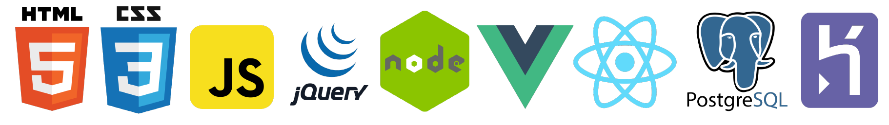

# Nice to meet you, I'm Lorina 

I'm a recent graduate from SPICED Academy's Full Stack Coding Bootcamp. This is a 12 week full-time bootcamp focused on JS.  
At the moment I am looking for a possibility to learn fast, strengthen my JavaScript skills and contribute to a motivated team.\
Prior I was a project manager in the tourism industry, and lately I discovered a passion for design. Currently I work for CM4All in Cologne. 

## Programming Languages & Frameworks I've learned so far:

 

## Please have a look at my projects:

 

## I am currently working on a recipe manager in order to learn Korean cuisine:

## Also:

